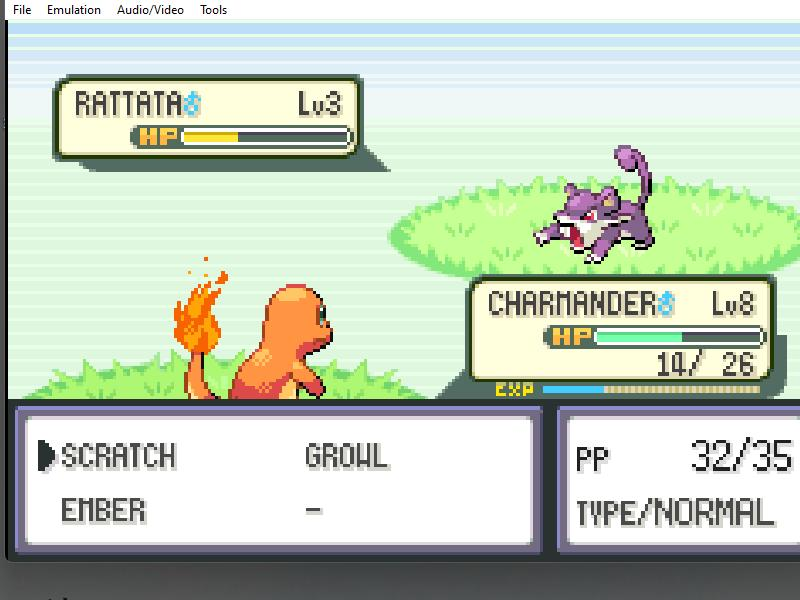

# Pokebot: An Automated Gameboy Advanced Emulator Bot for Leveling Up Your Pokémon



<p style='text-align: justify;'>
For almost two decades, Pokémon has been a source of fascination for players worldwide. In this game, leveling up your team is an essential aspect that determines your success. However, it's not always easy to level up your Pokémon, and it can take a lot of time and effort. But, with the help of Pokebot, a revolutionary application designed to automate the leveling-up process, players can drastically reduce the time and effort required to raise their Pokémon. This app works by analyzing in-game images and using convolutional neural networks (CNN) to make judgments based on the current game state. For instance, if you choose Bulbasaur as your starter Pokémon, the game becomes relatively easy as it gives you an advantage in all gym battles up to the fire gym. On the other hand, choosing Charmander can make the starter gyms challenging since they are strong against fire-type Pokémon. Nonetheless, with the help of Pokebot, players can level up their team effortlessly and enjoy the game to the fullest.
</p>

This project was done in a `windows machine`. With the following folder structure - 

```
  ├── README.md            <- The top-level README in the home page. 
  │
  ├── Static               <- Static images for the readme 
  │
  ├── data
    ├── test               <- Color test images for vanilla CNN model
    │
    ├── train              <- Color train images for vanilla CNN model 
    │
    ├── test_bw            <- Gray test images for complex (2 image input) CNN model
    │
    ├── train_bw           <- Gray train images for complex (2 image input) CNN model
    │
  ├── models
    ├── model.h5           <- Trained keras model for complex CNN
    ├── pokebot.pth        <- Trained Pytorch model for vanilla CNN
  ├── requirements.txt     <- Required python packages with versions
  ├── datagen.py           <- Data Generator that takes snaps of game screen while playing the game
  ├── move_char.py         <- The script used to move the character in game
  ├── Notebooks
    ├── classifier.ipynb   <- The Keras model for 2-image complex CNN
    ├── classifier2.ipynb  <- The vanilla CNN model
    ├── play.ipynb         <- The Inference code to move character in game
  
 ```

### Shared Files
The Models are avialable here: [Keras](https://drive.google.com/file/d/1B5V_9cC2Bm0NKFYH24t-RSWavlItuQAR/view?usp=sharing), [Pytorch](https://drive.google.com/file/d/1cA4OFxwSRye-Mbuv0XevyZtrnlHTKnan/view?usp=sharing)
<br>
The Data is available here: [archive.zip](https://drive.google.com/file/d/1iCfYR5WwAYLBsJbcaoknU6YLj1XDmMSd/view?usp=sharing)


### How to reproduce results
<ul>
<li>Install Python packages with <code>pip install -r requirements.txt</code></li>
<li>Run through <code>classifier.ipynb</code> to train, save and test the Keras model</li>
<li>Run through <code>classifier2.ipynb</code> to train, save and test the pytorch model</li>
<li><code>play.ipynb</code> imports the saved models and utilizes <code>move_char.py</code> to move the character in game.</li>
<li>make sure to click the emulator to select it as the active window after running the last cell of the <code>play.ipynb</code></li>
</ul>
